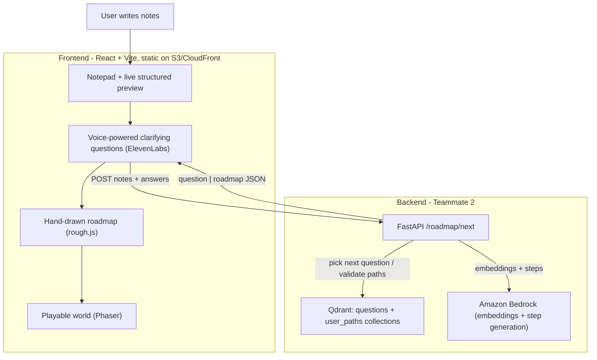

# Pathfinder

**Write what you're trying to figure out. Pathfinder reads along, asks a couple of sharp questions, and turns your messy notes into a hand-drawn roadmap you can actually follow — then lets you play it as a living world.**

Built for the Qdrant Vector Space Day Hackathon. Qdrant is the engine at the core: instead of a chatbot, Pathfinder uses vector search to (1) pick the most useful clarifying question to ask next and (2) validate each candidate path against *similar people's real outcomes* — then shapes a personalized roadmap from that.

---

## Why it's not a chatbot

The interesting interaction isn't Q&A — it's the loop:

1. You free-write notes about a goal (paying off loans, a cert, a health goal…).
2. The notes are structured and embedded; Qdrant finds the **most informative next question** to ask.
3. Each answer updates a feature vector; a decision tree proposes candidate paths.
4. For each path, Qdrant retrieves the **nearest similar users and their outcomes** — so the recommendation is grounded in "what actually worked for people like you" (e.g. *"84% of 12 similar people succeeded on this path"*).
5. The chosen path becomes a **hand-drawn roadmap**, which doubles as a **playable platformer world** where each step is a level and risks become hazards.

## Architecture



## The data contract

Everything the frontend and game render comes from one JSON shape, so the pieces stay in sync:

```jsonc
{
  "domain": "finance",
  "goal": "Pay off loans and start investing",
  "steps": [
    { "id": 0, "title": "Build an emergency fund", "difficulty": "easy",
      "status": "done", "is_risk": false }
    // status: done | in_progress | not_started ; is_risk -> hazard/"Bowser" level
  ]
}
```

The frontend talks to the backend through a single seam ([src/lib/api.ts](src/lib/api.ts), `advanceInterview`): a stateless multi-turn call to `POST /roadmap/next` that returns either the next `question` or the finished `roadmap` (+ `constraints` and a `rationale`). Until the backend URL is set it runs against a built-in mock, so the whole experience is demoable offline.

## Tech stack

- **Frontend:** React 19 + TypeScript + Vite, Tailwind v4, [rough.js](https://roughjs.com/) (hand-drawn roadmap), [Phaser](https://phaser.io/) (the game), ElevenLabs (spoken questions) + Web Speech (voice answers).
- **Backend (Teammate 2):** FastAPI, **Qdrant** (vector search), sentence-transformers / **Amazon Bedrock** (embeddings + step generation), scikit-learn.
- **Hosting:** static frontend on **AWS S3 + CloudFront**; backend on AWS (container).

## Run it locally (the demo setup)

Two processes on one machine — plug and play:

```bash
# 1. Backend (Teammate 2's repo): serves the Qdrant interview on :8000
python3 -m uvicorn agent_system:app --port 8000

# 2. Frontend
npm install
npm run dev          # http://localhost:5173
```

In dev the frontend **auto-targets `http://localhost:8000`**, so no env var is needed — it just works once the backend is up. If the backend isn't running, it **falls back to the built-in mock** so the app still works.

Optional config — copy `.env.example` to `.env` and set:

```bash
# spoken interview (ElevenLabs):
VITE_ELEVENLABS_API_KEY=...
VITE_ELEVENLABS_VOICE_ID=...
# override the backend URL (e.g. a cloudflared tunnel or a deployed API):
VITE_API_BASE_URL=https://your-backend-host
```

Build for production:

```bash
npm run build        # -> dist/
npm run preview      # serve the build locally
```

## Deploy

Static hosting on AWS — see [DEPLOY.md](DEPLOY.md) for the full S3 + CloudFront walkthrough. Quick deploy:

```bash
BUCKET=your-bucket [DISTRIBUTION_ID=...] [VITE_API_BASE_URL=...] npm run deploy
```

## How the demo flows

See [DEMO.md](DEMO.md) for the 3-minute walkthrough / shot list.

## Team

- **Frontend & integration:** the notepad, structured-notes preview, voice-powered interview, hand-drawn roadmap, AWS hosting.
- **Backend / knowledge base (Teammate 2):** the Qdrant interview engine + Bedrock.
- **Game world (Teammate 3):** the Phaser platformer that the roadmap becomes.

## Notes

- The frontend never hardcodes step content — it renders entirely from the roadmap JSON, so swapping the mock for the live backend is a single env var.
- Built during the hackathon period.
